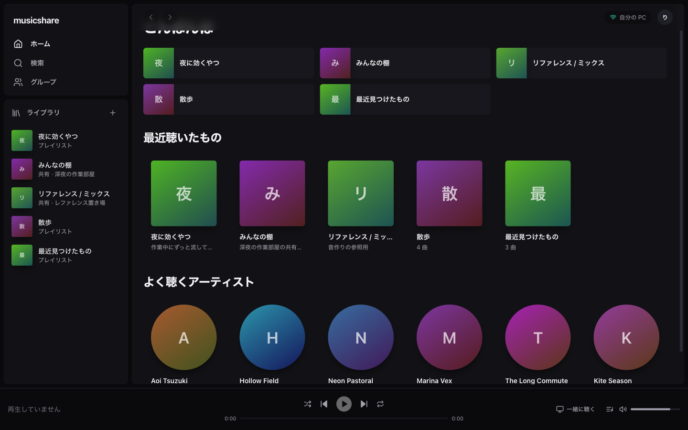
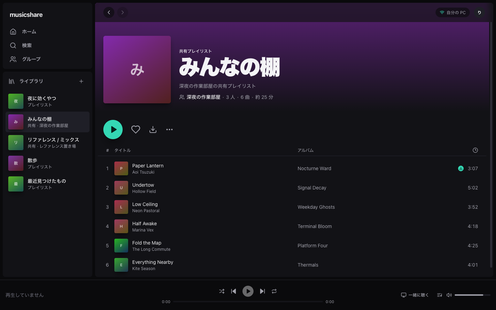
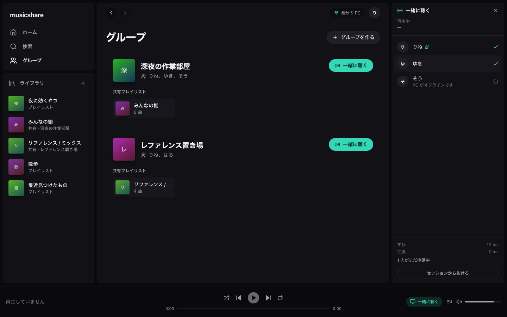

# musicshare

友だちとプレイリストを共有して、同じ曲を同じ位置で一緒に聴くための音楽クライアント。

PC ではデスクトップアプリ、スマートフォンでは PWA として動く。

---

## いま何ができているか

**検索して曲を再生できる。** macOS 上のブラウザで動作を確認済み。

| 層 | 状態 |
|---|---|
| 共有型・プロトコル定義 (`packages/shared`) | 定義済み |
| 中央サーバー (`packages/hub`) | API + 同時リスニングの WebSocket まで実装済み。UI とは未接続 |
| PWA (`packages/web`) | **検索・再生が実データで動く**。プレイリスト表示はまだモック |
| デスクトップ (`packages/desktop`) | 内蔵サーバーと解決処理が動作。UI から利用中 |

確認済みの動作:

- 検索 → 曲を選択 → 再生開始、再生位置が進む
- 長さの取得、シーク、次へ / 前へ
- MediaSession に曲名と再生状態が入る（ロック画面表示の前提）
- Tailscale の HTTPS 経由で、画面・API・音声すべて到達

**iPhone 実機での確認はこれから。** 手順は [docs/ios-testing.md](docs/ios-testing.md)。
ここで画面ロック中の再生が成立するかが、この構成を続けられるかの分かれ目になる。





---

## アーキテクチャ

3 つの層に分かれている。**どこに何を置くかが、この設計のほぼ全て**なので、変更するときは必ずここを読んでから触ること。

```
  スマートフォン (PWA)
        │  自分の PC にだけ音を取りに行く
        ▼
  自分の PC (デスクトップアプリ内蔵サーバー = node)
        │  自宅の回線から、自分のために取得する
        ▼
  供給元

  ─────────────────────────────────────────

  すべてのクライアント ──▶ 中央サーバー (hub)
        識別子・メタデータ・再生位置だけ。音声は通らない
```

### 中央サーバー (hub)

持つもの: アカウント、フレンド、グループ、プレイリストのメタデータ、再生位置の同期。

**持たないもの: 音声のバイト列。** ここを守る限り、帯域は利用者が増えてもほとんど増えないし、著作物を保持も中継もしていない状態を保てる。この前提を崩す変更は、コスト構造と法的な立ち位置の両方を同時に壊すので入れないこと。

### 各ユーザーの PC (node)

デスクトップアプリが内蔵サーバーとして常駐し、解決・取得・ダウンロードを行う。**各ユーザー自身の回線から、自分のために取得する**のがポイント。中央が代わりに叩きに行く構成にすると、供給元から見て 1 つの IP に集中し、bot 判定で即座に止まる。分散しているからこそ動く。

ウィンドウを閉じてもサーバーは止めない。落とすと外出先のスマートフォンから DL 済みの曲しか鳴らせなくなる。

### スマートフォン (PWA)

自分の PC の node にだけ接続する。到達手段は Tailscale を想定（同一 tailnet なので NAT 越えが不要、正規の HTTPS 証明書も取れる）。

**PC が落ちている間はダウンロード済みの曲しか再生できない。** これは仕様。だからダウンロード機能はおまけではなく再生経路の一部であり、UI でも常にキャッシュ状態を見せている。

### 同時リスニング

**音は誰からも送られてこない。** 参加者はそれぞれ自分の node から同じ曲を取得し、hub は「いつの時点で、何を、何秒の位置で鳴らしているか」だけを配る。各クライアントが NTP と同じ要領で hub との時計のズレを測り、自分の再生位置を合わせにいく。

この方式のおかげで:

- 中継サーバー (TURN) が要らない
- hub の帯域は毎秒数十バイト
- 音質が劣化しない（各自ローカルから再生するため）
- 参加者同士で IP が見えない

ズレの吸収は 2 段階。わずかなら次の tick で滑らかに詰め、大きく外れたときだけシークする（`SYNC_DRIFT_NUDGE_MS` / `SYNC_DRIFT_SEEK_MS`）。

参加者ごとに取得の成否が変わりうるので、「誰がまだ準備できていないか」を必ず UI に出す。黙って一人だけ無音になるのが最悪の壊れ方なので、そこは隠さない。

---

## セットアップ

```bash
pnpm install
```

### 開発時の起動

```bash
# 自分の PC の node サーバー (音声の取得を担う。これがないと何も鳴らない)
pnpm --filter @musicshare/desktop dev

# PWA (http://localhost:5273)
pnpm dev:web

# 中央サーバー (http://localhost:47820)。同時リスニングを使うときだけ必要
pnpm dev:hub

# デスクトップアプリごと起動する場合
pnpm --filter @musicshare/desktop dev:electron
```

画面側は node と hub を同一オリジンに中継している（`/node-api`, `/hub-api`）。
スマートフォンからは HTTPS で入ってくるため、HTTP の node を直接叩くと混在コンテンツで弾かれる。
**この中継を外さないこと。**

### スマートフォンから開く

```bash
tailscale serve --bg --https=8443 http://127.0.0.1:5273
```

詳しくは [docs/ios-testing.md](docs/ios-testing.md)。

### 必要なもの

- Node.js 22 以上
- pnpm
- ストリーム解決用の CLI（`MUSICSHARE_RESOLVER` 環境変数でパスを指定可能。既定は PATH 上の `yt-dlp`）

---

## 次にやること

1. **iPhone 実機でロック画面の再生を確認する（最優先）** — [手順](docs/ios-testing.md)。ここが駄目なら構成ごと見直し
2. **オフラインキャッシュ** — Cache Storage に保存し、PC オフ時の再生経路を成立させる
3. **hub に接続** — プレイリスト表示のモックを実 API に差し替える
4. **同時リスニングの実接続** — WebSocket は実装済み。UI と繋ぐ
5. **last.fm 連携**

完了済み: 再生経路の疎通、Tailscale 経由での到達。

その先（V1.5 以降）: プレイリスト変換、ボーカル抽出。

### 分かっている技術的な注意点

- **解決処理は壊れる前提で作る。** 供給元の仕様変更で全ユーザーが同時に無音になる事故が、法的な問題よりも遥かに高い確率で起きる。壊れたときは必ず理由を表示し、DL 済みのみ再生する縮退動作へ落とすこと（`resolver.ts` の `summarize` が入口）
- **PWA では外部 URL を直接叩かない。** node が中継することで CORS と Range を自前で扱える。この形を崩さない
- iOS の挙動（バックグラウンド再生、Cache Storage のパージ）は未検証。実機で確認するまで前提にしない

---

## 運用上の方針

この構成を選んだのは、コストと法的な露出の両方を最小にするため。以下は設計と一体なので、変更するときは影響を考えること。

- **中央サーバーに著作物を通さない**（この文書で繰り返している通り）
- **無料・非営利で運営する。** 営利性は責任論で最も不利に働く
- **供給元のサービス名を、名称・宣伝・UI・ドメインのどこにも出さない**
- **「広告なし」を訴求にしない。** 訴求は共有と同時リスニングに一本化する
- **ローカルファイルなど、供給元に依存しない用途でも動くように作る**
- 利用規約に問い合わせ窓口と、繰り返し侵害への対応方針を明記する
- 自宅で運用する場合、グローバル IP を露出させない（Cloudflare Tunnel 等を挟む）
